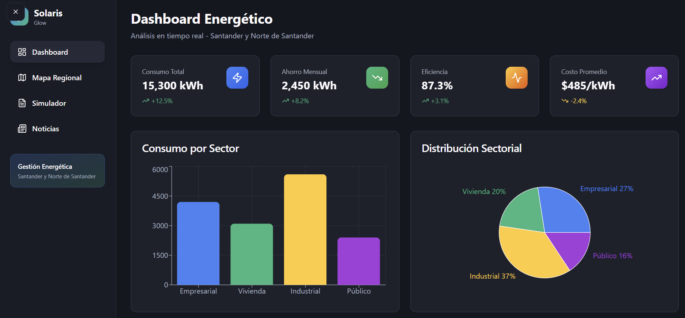

<p align="center">
  
</p>

<h1 align="center">☀️ <b>Solaris Glow — Gestión Energética Sostenible</b></h1>

<p align="center">
  <i>“La energía del futuro, visualizada hoy.”</i>
</p>

---

## ⚡ **Descripción general**

**Solaris Glow** es una plataforma moderna, interactiva y sostenible desarrollada con **React + Vite + TailwindCSS + Firebase**.
Permite **visualizar y optimizar el consumo energético** a través de gráficos dinámicos, autenticación segura y análisis inteligente de datos.
Está pensada para ayudar a empresas, instituciones y usuarios a comprender y mejorar su huella energética.

<p align="center">
  
  
  
  
  
</p>

---

## 🚀 **Características principales**

- 📊 **Visualizaciones interactivas** con Recharts y animaciones de Framer Motion.
- 🔐 **Autenticación con número telefónico (Firebase Auth + reCAPTCHA)**.
- ☁️ **Backend serverless** mediante Firestore y Firebase Hosting.
- 🌙 **Modo oscuro y claro** configurable con Next Themes y Tailwind.
- 🌍 **Mapas energéticos** con React Leaflet y Google Maps API.
- ⚡ **Rendimiento optimizado** gracias a Vite + React 19.
- 🧩 **Arquitectura modular** con hooks y componentes reutilizables.

---

## 🧠 **Tecnologías utilizadas**

| Categoría                       | Tecnologías                                                           |
| ------------------------------- | --------------------------------------------------------------------- |
| 💻 **Frontend**                 | React 19 · TypeScript · Vite · TailwindCSS · Radix UI · Framer Motion |
| 📈 **Visualización**            | Recharts · Embla Carousel · Lucide Icons                              |
| 🔒 **Backend & Auth**           | Firebase Auth · Firestore · Firebase Hosting                          |
| 🧾 **Formularios & Validación** | React Hook Form · Zod                                                 |
| 🗺️ **Mapas & Geolocalización**  | Leaflet · React-Leaflet · Google Maps API                             |
| ✨ **Extras**                   | Sonner (toasts) · React Query · clsx · tailwind-merge                 |

---

## 🧩 **Estructura del proyecto**

```
src/
 ├── components/     → Componentes visuales y reutilizables
 ├── hooks/          → Custom hooks y lógica compartida
 ├── lib/            → Configuración de Firebase y utilidades
 ├── pages/          → Páginas principales de la aplicación
 ├── App.tsx         → Raíz de la aplicación React
 ├── index.css       → Estilos globales (Tailwind)
 └── main.tsx        → Punto de entrada de Vite
```

---

## 🛠️ **Instalación local**

```bash
# 1️⃣ Clona el repositorio
git clone https://github.com/tuusuario/solaris-glow.git

# 2️⃣ Entra en el proyecto
cd solaris-glow

# 3️⃣ Instala las dependencias
npm install

# 4️⃣ Ejecuta en modo desarrollo
npm run dev
```

---

## 🔥 **Despliegue en Firebase**

```bash
# Construye la app para producción
npm run build

# (Opcional) Previsualiza el resultado
npm run preview

# Despliega a Firebase Hosting
firebase deploy
```

---

## 💡 **Inspiración**

Solaris Glow nació con la visión de **democratizar la gestión energética** y promover una relación más consciente con el consumo eléctrico.
El proyecto combina **tecnología moderna, diseño visual y propósito ecológico** para inspirar un futuro más limpio y sostenible.

---

## 🧑‍💻 **Autor**

**Metazack89**
🔗 [GitHub](https://github.com/metazack89) • 🌐 [Demo en línea](https://solaris-glow-40b8c.web.app/)

---

> 🌞 _“Solaris Glow — Porque la energía del mañana comienza con la claridad de hoy.”_
